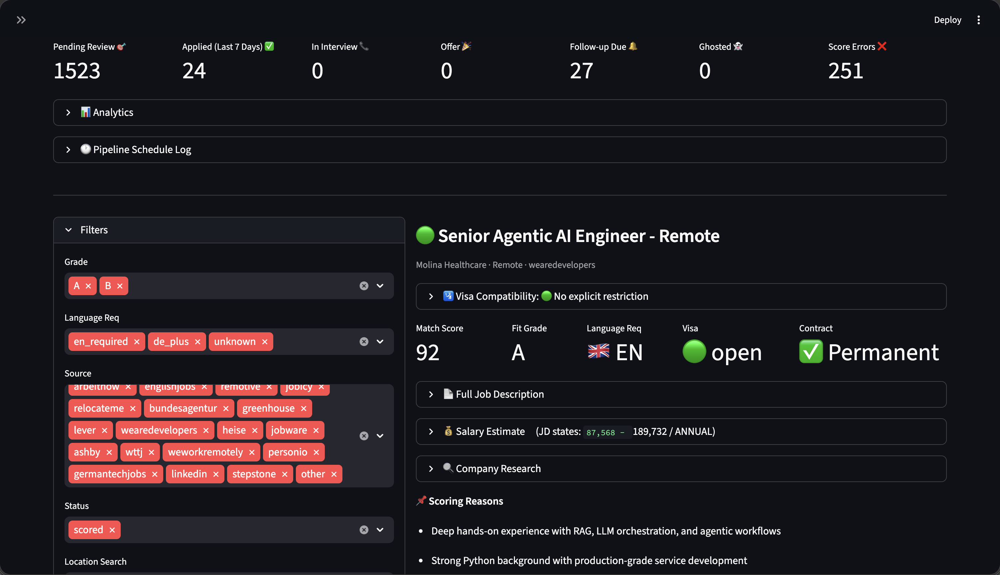

# Job Hunter


專為德國科技職缺市場設計的自架求職 Pipeline：爬取 → AI 評分 → 審閱 & 投遞。

為在德國求職的國際人才打造 — 內建 **Chancenkarte 持有者**專屬分析、德文 JD 自動翻譯，以及簽證相容性檢查。



---

## 為什麼做這個

以非 EU 身份在德國找科技工作，跟一般求職是完全不同的問題：

- 職缺分散在 9 個以上平台，許多是德文
- 每一封 Cover Letter 都必須客製化——通用版直接進垃圾桶
- 大多數 JD 對簽證要求語焉不詳（Chancenkarte ≠「無工作許可」）
- 面試流程漫長；等到回覆時，早就忘了這個職缺在做什麼

這個工具把繁瑣的部分自動化（爬取、去重、評分、Cover Letter 草稿），讓你把精力放在真正重要的地方：判斷哪些職缺值得投遞，以及面試準備。

---

## 功能特色

**Pipeline**
- 每日排程爬取 9 個來源（API + HTML，依 JD 內容雜湊自動去重）
- 自動偵測德文 JD 並翻譯為英文後再評分
- 基於個人履歷知識庫的 RAG 增強 LLM 評分
- A/B/C 分級，含來源加分機制（Relocate.me、Greenhouse、Lever、Bundesagentur）
- 每筆職缺自動產出 Cover Letter，支援三種語氣調整（正式 / 新創 / 精簡）

**Chancenkarte & 簽證**
- 每筆職缺自動分類簽證限制（`open` / `eu_only` / `sponsored` / `unclear`）
- 一鍵深度 Chancenkarte 相容性分析：掃描 JD 中的限制字句、依 §20a AufenthG 判斷申請可行性、建議如何在 Cover Letter 和第一封信中說明簽證身份

**按需分析（每筆職缺，一鍵觸發）**
- 薪資估計 + 談判建議（市場區間、開價建議、底線）
- 公司研究（爬取官網 + LLM 摘要：技術棧、文化、搬遷政策）
- 面試準備單：角色摘要、核心技術要求、推斷痛點、你的相關亮點、5 個可能被問的問題

**應聘追蹤**
- 完整狀態流程：`已評分 → 已投遞 → 一面 → 二面 → Offer / 已拒絕`
- 每輪結構化面試記錄（日期、形式、問題、自我評分、感想）
- 跟進提醒（投遞後自動設為 7 天，可自訂）
- 重複投遞警告（偵測是否已投遞過同公司其他職缺）
- 統計儀表板：等級分布、來源效益表、應聘漏斗、每週投遞趨勢

**靈活性**
- 支援 OpenAI、Mistral AI（有免費方案）、Azure OpenAI，或任何本地/自訂 LLM 端點
- 完整 Docker 化 — 一行 `docker compose up -d` 即可啟動
- 儀表板支援 **English / 中文** 切換 — Sidebar 即時切換，無需重啟
- 所有個人資料（履歷、API Key、資料庫）留在本地，不上傳任何外部服務

---

## 運作方式

```
Phase 1（爬取）      →   Phase 2（評分）      →   Phase 3（儀表板）
9 個來源爬入             RAG + LLM 評分            審閱、編輯 CL、投遞、
SQLite 自動去重          每筆職缺產出               追蹤面試流程、
                         Cover Letter + 分數        按需 AI 分析
```

**Phase 1** 從 9 個來源爬取，依 JD 內容雜湊（第 50–550 字元，跳過平台套版開頭）去重。**Phase 2** 偵測德文 JD 並翻譯，透過 RAG 對照個人知識庫評分，分出 A/B/C 級。**Phase 3** 是 Streamlit 儀表板，用於審閱、編輯、投遞和追蹤完整面試流程。

---

## 目錄結構

```
job-hunter/
├── .env                          # API Key（不納入版本控制）
├── .env.example                  # 複製為 .env 後填入
├── requirements.txt
├── Dockerfile
├── docker-compose.yml
├── scheduler.py                  # 排程器（在 Docker 內運行）
├── phase1_ingestor.py            # 爬取職缺（9 個來源）
├── phase2_scorer.py              # LLM 評分 + Cover Letter + 面試準備單
├── phase3_dashboard.py           # Streamlit 審閱儀表板
├── check_api.py                  # LLM + Embedding API 連線快速檢查
├── config/
│   ├── grading_rules.md          # 評分規則（注入為 LLM System Prompt）
│   └── search_targets.yaml       # 關鍵字、地點、ATS 公司 slug
├── candidate_kb/                 # 個人履歷知識庫
│   ├── resume_bullets.md
│   ├── projects.md
│   └── visa_status.md
├── data/
│   └── jobs.db                   # SQLite 資料庫（不納入版本控制）
├── qdrant_data/                  # 本地向量資料庫（不納入版本控制）
├── logs/
│   └── pipeline.log              # 排程執行記錄
└── utils/
    ├── db.py                     # SQLite 操作 + 狀態流轉
    ├── kb_loader.py              # 從 candidate_kb/ 建立 Qdrant 知識庫
    ├── llm.py                    # OpenAI / Mistral / Azure / 自訂端點工廠
    ├── company_researcher.py     # 按需公司研究（爬網站 + LLM）
    ├── salary_estimator.py       # 按需薪資估計 + 談判建議
    └── visa_checker.py           # 按需 Chancenkarte 簽證相容性分析
```

---

## 快速開始

### 方式 A — Docker（推薦）

Docker 負責排程，保持主機環境乾淨。

```bash
# 1. 複製並填寫設定檔
cp .env.example .env
# 填入你的 API Key 和 Provider

# 填寫個人資料
nano config/grading_rules.md
nano config/search_targets.yaml
nano candidate_kb/resume_bullets.md
nano candidate_kb/projects.md
nano candidate_kb/visa_status.md

# 2. 建置並啟動
docker compose up -d

# 3. 建立知識庫（首次執行，以及每次修改 candidate_kb/ 後）
docker compose exec pipeline python utils/kb_loader.py

# 4. 確認 API 連線
docker compose exec pipeline python check_api.py

# 儀表板開啟於 http://localhost:8501
```

`pipeline` 服務執行 `scheduler.py`，每天 07:30（歐洲柏林時區）自動觸發 Phase 1 + Phase 2。`dashboard` 服務持續運行。

**修改程式碼後重建：**
```bash
docker compose build pipeline
docker compose up -d
```

**重新評分所有職缺**（修改 `grading_rules.md` 後）：
```bash
docker compose exec pipeline python phase2_scorer.py --rescore
```

### 方式 B — 本地（venv）

```bash
python3 -m venv .venv
source .venv/bin/activate       # Windows: .venv\Scripts\activate
pip install -r requirements.txt

cp .env.example .env
# 填寫 .env 和設定檔（同上）

python utils/kb_loader.py       # 建立知識庫（一次）

python phase1_ingestor.py       # 爬取
python phase2_scorer.py         # 評分
streamlit run phase3_dashboard.py
```

---

## 設定說明

### `.env`

```env
# LLM Provider：openai | mistral | azure | custom
LLM_PROVIDER=openai

# OpenAI
OPENAI_API_KEY=sk-...

# Mistral AI（有免費方案）
# LLM_PROVIDER=mistral
# MISTRAL_API_KEY=your_key_here
# CHAT_MODEL=mistral-large-latest
# EMB_MODEL=mistral-embed

# Azure OpenAI
# LLM_PROVIDER=azure
# AZURE_ENDPOINT=https://...
# AZURE_API_VERSION=2024-08-01-preview
# AZURE_CHAT_DEPLOYMENT=gpt-4o
# AZURE_EMB_DEPLOYMENT=text-embedding-3-small

# 自訂 / 本地端點（LiteLLM、Ollama、vLLM 等）
# LLM_PROVIDER=custom
# CUSTOM_BASE_URL=http://localhost:11434/v1

DB_PATH=./data/jobs.db
QDRANT_PATH=./qdrant_data
```

> **切換 Provider 注意**：若更換 Embedding 模型（例如從 OpenAI `text-embedding-3-small`（1536 維）換為 Mistral `mistral-embed`（1024 維）），必須重建知識庫：`python utils/kb_loader.py`

### `config/grading_rules.md`

定義 LLM 如何評分職缺與格式化 Cover Letter。填入你的技術棧、資歷、語言能力和目標地點。此檔案在每次 Phase 2 執行時作為 LLM System Prompt 注入——請保持精簡以降低 Token 用量。

### `config/search_targets.yaml`

控制各爬蟲使用的關鍵字和地點。Greenhouse 和 Lever 請填入公司 slug（在 `https://boards.greenhouse.io/{slug}` 和 `https://jobs.lever.co/{slug}` 確認有效性）。無效的 slug 執行時會自動跳過。可直接從儀表板編輯。

### `candidate_kb/`

三個構成 RAG 知識庫的 Markdown 檔案：

- `resume_bullets.md` — 以 STAR 格式撰寫的工作經歷，需有具體成果數字
- `projects.md` — 重要專案，含技術棧與具體成效
- `visa_status.md` — 工作許可、可上班日期、偏好地點

修改後重建知識庫：
```bash
docker compose exec pipeline python utils/kb_loader.py
```

若 `candidate_kb/` 的檔案比知識庫更新，Phase 2 會發出警告提醒重建。

### 用 AI 生成設定檔

評分品質和 Cover Letter 品質，幾乎完全取決於這些檔案寫得好不好。以下 Prompt 可直接丟給任何 LLM（Claude、ChatGPT 等）產出初稿。

**`candidate_kb/resume_bullets.md`**

將你的 CV 或 LinkedIn 工作經歷貼入後，發送：

```
請將以下工作經歷整理成 STAR 格式的 bullet points，供 RAG 知識庫使用。
要求：
- 每條必須包含具體可量化的成果（百分比、節省時間、規模等）
- 技術名稱照職缺上的寫法，不要縮寫或自創
- 依職位分組，標明公司名稱與在職期間
- 具體描述，避免「改善效能」或「負責後端」這類模糊說法

[貼入你的 CV / LinkedIn 工作經歷]
```

**`candidate_kb/projects.md`**

```
請幫我整理以下專案資訊，供撰寫 Cover Letter 的 RAG 知識庫使用。
每個專案請包含：專案用途、技術棧（完整的函式庫／框架名稱）、
規模或成效數字，以及我的具體貢獻。

[貼入你的專案描述]
```

**`candidate_kb/visa_status.md`**

```
請幫我撰寫一份簡短的 RAG 知識庫條目，描述我的工作許可狀態。
請包含：簽證類型及允許事項、偏好地點與彈性、各語言程度、
可上班日期，以及是否願意搬遷。

我的狀況：[描述你的簽證、地點、語言、可上班時間]
```

**`config/grading_rules.md`**

```
我正在設定一個職缺評分系統，請協助填寫評分規則中的候選人資料欄位。

我的資料：
- 目前職位／年資：[例：Backend Engineer，5 年]
- 核心技術棧：[例：Python、FastAPI、Node.js、GCP、Docker]
- 在德國的目標職位：[例：Backend Engineer、AI Engineer、Platform Engineer]
- 語言能力：[例：英語流利、德語 A2]
- 地點偏好：[例：漢堡或遠端]
- 簽證狀況：[例：Chancenkarte 持有者，長期需要 Sponsorship]

請用具體的數值取代以下檔案中的候選人資料欄位：

[貼入 config/grading_rules.md 的現有內容]
```

> 產出後請自行審閱，修正 LLM 捏造或有誤的地方。RAG 系統的品質取決於你放進去的資訊是否真實準確。

---

## 職缺來源

| 來源 | 方式 | 說明 |
|------|------|------|
| [Arbeitnow](https://www.arbeitnow.com) | JSON API | 穩定；含英德文職缺 |
| [EnglishJobs.de](https://englishjobs.de) | HTML 爬取 | 德國英語職缺 |
| [Bundesagentur für Arbeit](https://api.arbeitsagentur.de) | REST API | 德國官方職缺平台 |
| [Remotive](https://remotive.com) | JSON API | 純遠端，英語 |
| [Relocate.me](https://relocate.me) | HTML 爬取 | 提供搬遷協助的職缺 |
| [Jobicy](https://jobicy.com) | JSON API | 純遠端；含地區排除篩選 |
| [Greenhouse ATS](https://boards-api.greenhouse.io) | JSON API | 公司專屬職缺板，無需認證 |
| [Lever ATS](https://api.lever.co) | JSON API | 公司專屬職缺板，無需認證 |
| LinkedIn / StepStone / 其他 | 儀表板手動 | 搜尋捷徑按鈕 + 手動新增表單 |

GermanTechJobs 目前停用（JS SPA，需 Playwright）。

---

## 評分機制

### 去重

職缺依 JD 文字第 50–550 字元的 MD5 雜湊去重。跳過前 50 字元是為了避免平台套版開頭（如「We are an equal opportunity employer…」）造成跨平台誤判為重複。同一職缺在多個平台刊登時只儲存一次。

### 德文 JD 翻譯

Phase 2 使用 Token 頻率啟發式方法（>8% 德文功能詞）偵測德文 JD，偵測到後透過單次 LLM 呼叫翻譯為英文再評分與向量化。翻譯結果快取在資料庫中——重新評分時直接重用，不額外消耗 API。

### 預檢篩選（LLM 呼叫前）

| 條件 | 動作 |
|------|------|
| `expires_at` 已過期 | → `expired`（不呼叫 LLM） |
| JD 文字少於 100 字元 | → `error`（不呼叫 LLM） |

### 分級

分級邏輯在 `config/grading_rules.md` 中由 LLM 執行。評分後在 Python 端套用來源加分：

| 等級 | 條件 |
|------|------|
| A | 分數 ≥ 80，語言要求非 `de_required` |
| B | 60 ≤ 分數 < 80，語言要求非 `de_required` |
| C | 分數 < 60 或語言要求為 `de_required` |

**來源加分**（LLM 評分後在 Python 套用）：

| 來源 | 加分 | 原因 |
|------|------|------|
| relocateme | +10 | 公司主動提供搬遷協助 |
| greenhouse | +5 | 直接 ATS 刊登——積極招募訊號 |
| lever | +5 | 直接 ATS 刊登——積極招募訊號 |
| bundesagentur | +5 | 官方平台；簽證友善雇主比例較高 |

**簽證分類**（從 JD 文字判斷）：`open` · `eu_only` · `sponsored` · `unclear`

---

## 職缺狀態流程

```
un-scored（待評分）
    │
    ▼
  scored（已評分）──────────────────────────────────────────────────┐
    │                                                              │
    ├─→ applied（已投遞）→ interview_1（一面）→ interview_2（二面）→ offer（Offer）│
    │                      └──────────────────────────────┴─→ rejected（已拒絕）│
    ├─→ skipped（已略過）                                           │
    ├─→ error（失敗）     （LLM 連續失敗 3 次 — 可從儀表板重試）    │
    └─→ expired（已過期） （expires_at 已過 — Phase 2 自動標記）   ◄─┘
```

---

## 儀表板功能

### KPI 列
待審閱 · 本週投遞 · 面試中 · Offer · 待跟進 · 評分失敗

### 統計分析面板
等級分布 · 語言要求分布 · 應聘漏斗 · 來源效益表（A 級率、面試率）· 每週投遞趨勢（近 8 週）

### 職缺詳情面板

**評分總覽**
- 匹配分數、等級、語言要求、簽證分類、合約類型
- 前 3 條評分理由

**重複投遞警告**
若你曾投遞過同公司其他職缺，會顯示先前的職位名稱和目前狀態。

**簽證相容性（🛂）**
顯示評分階段的粗略簽證分類。對於 `eu_only` 職缺，可點擊「深度分析」按鈕執行 Chancenkarte 專屬 LLM 分析：掃描 JD 中的相關字句，判斷持卡人是否可申請，並建議如何在 Cover Letter 和第一封信中說明簽證身份。

**薪資估計（💰）**
產出 LLM 薪資估計（市場區間、信心水準、談判開價與底線），參考 JD 資訊、地點和公司規模。附 Glassdoor、Kununu、Levels.fyi 連結供人工查詢。

**公司研究（🔍）**
爬取公司 about/官網頁面，結合 JD 產出結構化公司側寫：概況、技術棧、文化、國際化友善度、面試談話重點。

**Cover Letter**
- 可直接編輯的文字框，即時字數統計（目標 200–400 字）
- 語氣選擇器：**正式**（企業風格）、**新創**（直接有個性）、**精簡**（≤200 字）
- 一鍵以選定語氣重新生成
- 下載為 `.docx`（適用需上傳附件的申請）

**操作按鈕**（隨狀態變化）：
- `已評分`：開啟職缺 · 複製 CL · 已投遞 · 略過 · 重新評分
- `已投遞`：開啟職缺 · 面試邀約（自動生成準備單）· 已拒絕
- `一面 / 二面`：開啟職缺 · 進入下一階段 · 已拒絕
- `Offer / 已拒絕 / 已略過`：僅開啟職缺

**面試準備單**
進入面試階段時自動生成。包含：角色摘要、核心技術要求、推斷的挑戰與痛點、你的相關亮點（從知識庫比對）、5 個可能被問到的問題。可按需重新生成，支援下載為 Markdown。

**面試記錄**
記錄每輪面試：日期、面試官、形式（電話 / 視訊 / 現場 / 技術面試）、被問到的問題、自我評分（1–5）、感想。依職缺儲存，可在儀表板查看和刪除。

**備註 & 跟進提醒**
自由文字備註欄位。跟進提醒日期（投遞後自動設為 7 天，可自訂）。

### 左欄其他工具
- **Pipeline 記錄檢視器**：`logs/pipeline.log` 最後 100 行 + 立即執行按鈕
- **搜尋條件管理員**：直接從儀表板編輯關鍵字、Greenhouse slug、Lever slug
- **手動新增職缺**：貼入任何 JD（LinkedIn、StepStone、公司官網職缺頁）
- **LinkedIn 搜尋捷徑**：預設目標關鍵字的搜尋連結

---

## LLM Provider 說明

| Provider | Structured Outputs | Rate Limit | Embedding 維度 |
|----------|--------------------|------------|----------------|
| OpenAI（`gpt-4o`） | 支援 | 無（依方案） | 1536 |
| Mistral（`mistral-large-latest`） | 不支援（JSON mode） | 1 req/sec | 1024 |
| Azure OpenAI | 支援 | 無（依部署） | 1536 |
| 自訂 / 本地 | 不支援（JSON mode） | 無 | 不定 |

**每筆職缺 Token 用量**（估計值）：

| 操作 | API 呼叫次數 | Token 數 |
|------|-------------|----------|
| 評分 + Cover Letter | 2（1 批次 embed + 1 chat） | 3,500–8,000 |
| 德文翻譯（若需要） | 1 chat | 1,000–3,000 |
| 面試準備單 | 2（1 embed + 1 chat） | 4,000–7,500 |
| Cover Letter 重新生成 | 2（1 embed + 1 chat） | 2,500–5,000 |
| 公司研究 | 1 chat | 2,000–4,000 |
| 薪資估計 | 1 chat | 1,500–3,000 |
| 簽證分析 | 1 chat | 1,500–3,000 |

所有按需分析（簽證、薪資、公司研究）皆為每筆職缺選擇性觸發——點擊儀表板按鈕後才執行。

---

## 其他說明

- Bundesagentur API 目前停用 SSL 驗證（`verify=False`）。待 API 憑證穩定後移除。
- 所有個人檔案（`.env`、`candidate_kb/*.md`、`config/grading_rules.md`、`config/search_targets.yaml`、`data/`、`qdrant_data/`）已透過 `.gitignore` 排除在版本控制外。
- 排程器在 **歐洲柏林時區** 07:30 執行（透過 `docker-compose.yml` 中的 `TZ=Europe/Berlin` 設定）。如需調整時間，修改 `docker-compose.yml` 中的 `command:` 行（參數為 `時 分`）。
- `check_api.py` 同時驗證 Chat 和 Embedding API 連線，並印出偵測到的 Embedding 維度——切換 Provider 後特別有用。
