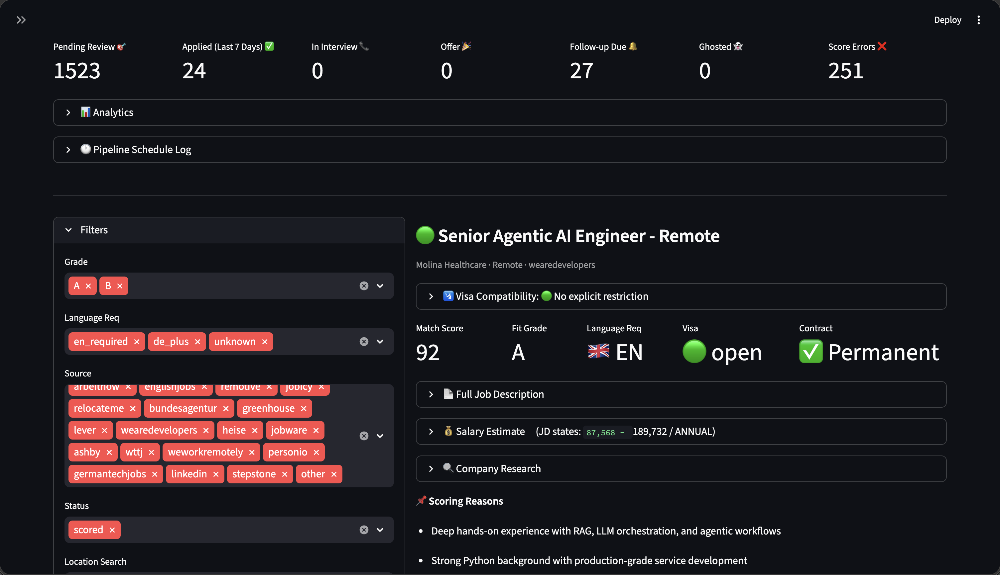

# Job Hunter


專為德國科技職缺市場設計的自架求職 Pipeline：爬取 → AI 評分 → 審閱 & 投遞。

為在德國求職的國際人才打造 — 內建 **Chancenkarte 持有者**專屬分析、德文 JD 自動翻譯，以及簽證相容性檢查。



---

## 為什麼做這個

以非 EU 身份在德國找科技工作，跟一般求職是完全不同的問題：

- 職缺分散在 16 個以上平台，許多是德文
- 每一封 Cover Letter 都必須客製化——通用版直接進垃圾桶
- 大多數 JD 對簽證要求語焉不詳（Chancenkarte ≠「無工作許可」）
- 面試流程漫長；等到回覆時，早就忘了這個職缺在做什麼

這個工具把繁瑣的部分自動化（爬取、去重、評分、Cover Letter 草稿），讓你把精力放在真正重要的地方：判斷哪些職缺值得投遞，以及面試準備。

---

## 功能特色

**Pipeline**
- 每日排程爬取 14 個來源（API + HTML，依 JD 內容雜湊自動去重）；另有 3 個爬蟲能跑但刻意關閉
- 自動偵測德文 JD 並翻譯為英文後再評分
- JD 注入 LLM 前先做清理，防禦職缺描述中夾帶的 Prompt Injection 攻擊
- 基於個人履歷知識庫的 RAG 增強 LLM 評分
- A/B/C 分級：直接 ATS 刊登有來源加分，資歷過度超出的職稱則降權
- 每筆職缺自動產出 Cover Letter，支援三種語氣調整（正式 / 新創 / 精簡）
- 每次 LLM 呼叫都記進 JSONL 帳本並附估計成本，另有選用的每日預算——失控時中止的是這次執行，不是你的信用卡額度

**半自動投遞**
- 地理分流：裸 "Remote" 職缺按「德國可否受僱」分類（每日免費規則層;LLM 補判按需手動觸發），關鍵字漏掉的德國地名自動正規化,不再默默掉出佇列
- ATS 掃描：逐筆判定 ATS 平台、職缺存活狀態、回填直達投遞連結
- 排序投遞佇列（同公司去重閘門 + 每日額度），Stage 1 為每筆佇列職缺生成有依據的草稿回答
- 瀏覽器套件：ATS 表單一鍵填入個人資料（含 CV 上傳）、💰 期望薪資與 📄 Cover Letter 回答面板、投遞後自動回帳追蹤——**永遠由人審閱、人按送出**

**Chancenkarte & 簽證**
- 每筆職缺自動分類簽證限制（`open` / `eu_only` / `sponsored` / `unclear`）
- 一鍵深度 Chancenkarte 相容性分析：掃描 JD 中的限制字句、依 §20a AufenthG 判斷申請可行性、建議如何在 Cover Letter 和第一封信中說明簽證身份

**按需分析（每筆職缺，一鍵觸發）**
- 薪資估計 + 談判建議（市場區間、開價建議、底線）
- 公司研究（爬取官網 + LLM 摘要：技術堆疊、文化、搬遷支援/Relocation 政策）
- 面試準備單：角色摘要、核心技術要求、推斷痛點、你的相關亮點、5 個可能被問的問題，外加針對你自己過往一面實際記錄下來的題目給出的建議答法

**求職追蹤**
- 完整狀態流程：`已評分 → 已投遞 → 一面 → 二面 → Offer / 已拒絕`
- 每輪結構化面試記錄（日期、形式、問題、自我評分、感想）
- 跟進提醒（投遞後自動設為 7 天，可自訂）
- 重複投遞警告（偵測是否已投遞過同公司其他職缺）
- 草稿老化：等待中的草稿會顯示已經放多久，超過 7 天的排到最上面並標記——草稿還在等的時候，職缺就過期了
- 統計儀表板：等級分布、來源效益表、求職漏斗、每週投遞趨勢、LLM 估計花費

**靈活性**
- 支援 OpenAI、Mistral AI、Azure OpenAI，或任何本地/自訂 LLM 端點——模型名稱依 Provider 分組解析，切換 `LLM_PROVIDER` 就整組換掉，其他 Provider 殘留的設定不會亂入
- 完整 Docker 化 — 一行 `docker compose up -d` 即可啟動
- 儀表板支援 **English / 中文** 切換 — Sidebar 即時切換，無需重啟
- 所有個人資料（履歷、API Key、資料庫）留在本地，不上傳任何外部服務

---

## 運作方式

每日 pipeline（Docker 內執行,間隔式追趕排程）：

```
phase1_ingestor → remote_geo_triage → phase2_scorer → ats_scan → apply_stage1
14 個來源爬入      Remote/漏網德國      RAG + LLM       ATS 平台      投遞佇列
SQLite 自動去重    地名重標             評分、CL、翻譯   + 存活檢查    草稿生成
```

**Phase 1** 從 14 個來源爬取，依 JD 內容雜湊（第 50–550 字元，跳過平台套版開頭）去重。**地理分流**把裸 `Remote` 職缺按德國可否受僱重標,並正規化關鍵字漏掉的德國地名（`"Dresden (DE)"`、`"54595 Prüm"`、二線城市）——明確境外的職缺完全跳過 LLM 評分,評分開銷約砍半。**Phase 2** 偵測德文 JD 並翻譯，透過 RAG 對照個人知識庫評分，分出 A/B/C 級。**ats_scan** 判定每筆佇列候選跑在哪個 ATS（Greenhouse / Lever / Ashby / Workable / Personio…）以及是否還活著。**Stage 1** 建立排序佇列（同公司去重、每日額度）並生成有依據的投遞草稿。

**Phase 3** 是 Streamlit 儀表板，用於審閱、編輯、投遞和追蹤完整面試流程;搭配瀏覽器套件在 ATS 表單一鍵填入個人資料、複製貼上式回答開放題——**送出永遠由人審閱後親自按下,不會自動投遞。**套件的安裝與使用說明見 [`extension/README.md`](extension/README.md)。

---

## 目錄結構

```
job-hunter/
├── .env                              # API Key（不納入版本控制）
├── .env.example                      # 複製為 .env 後填入
├── requirements.txt
├── Dockerfile
├── docker-compose.yml
├── run_pipeline.sh                   # 手動全鏈執行（儀表板「立即執行」按鈕呼叫）
├── scheduler.py                      # 追趕式排程器（間隔制,中斷後從未完成的 stage 續跑）
├── phase1_ingestor.py                # 爬取職缺（14 個啟用來源，另 3 個關閉）
├── remote_geo_triage.py              # Remote/漏網德國地名按受僱資格重標
├── phase2_scorer.py                  # LLM 評分 + Cover Letter + 面試準備單
├── ats_scan.py                       # ATS 平台判定 + 佇列候選存活檢查
├── apply_stage1.py                   # 投遞佇列草稿生成
├── apply_api.py                      # 瀏覽器套件的本機 sidecar API（127.0.0.1:8531）
├── phase3_dashboard.py               # Streamlit 審閱儀表板（支援 EN / 中文）
├── extension/                        # 瀏覽器套件：ATS 自動填入 + 回答面板
├── scripts/                          # 一次性回填腳本與量測實驗
├── tests/                            # 單元測試（在容器內執行）
├── check_api.py                      # LLM + Embedding API 連線快速檢查
├── LICENSE
├── README.md
├── README_TC.md                      # 繁體中文說明
├── config/
│   ├── grading_rules.md              # 評分規則（注入為 LLM System Prompt）
│   ├── grading_rules.md.example      # 範本 — 複製後自訂
│   ├── search_targets.yaml           # 關鍵字、地點、ATS 公司 slug
│   └── search_targets.yaml.example  # 範本 — 複製後自訂
├── candidate_kb/                     # 個人履歷知識庫（RAG 來源）
│   ├── resume_bullets.md
│   ├── resume_bullets.md.example
│   ├── projects.md
│   ├── projects.md.example
│   ├── visa_status.md
│   └── visa_status.md.example
├── docs/
│   └── screenshot.png
├── data/
│   ├── jobs.db                       # SQLite 資料庫（不納入版本控制）
│   └── llm_usage.jsonl               # 逐次呼叫的 token + 估計成本帳本（不納入版本控制）
├── qdrant_data/                      # 本地向量資料庫（不納入版本控制）
├── logs/
│   └── pipeline.log                  # 排程執行記錄
└── utils/
    ├── db.py                         # SQLite 操作 + 狀態流轉
    ├── kb_loader.py                  # 從 candidate_kb/ 建立 Qdrant 知識庫
    ├── llm.py                        # 端點工廠、chat/embed 封裝、用量帳本 + 預算閘門
    ├── geo_de.py                     # 德國地點比對（單一事實來源）
    ├── lang_req.py                   # 德語要求 regex 閘門（在任何 LLM 呼叫之前執行）
    ├── apply_queue.py                # 投遞佇列（去重閘門、額度、ATS 偏好排序）
    ├── apply_llm.py                  # 投遞流程共用 LLM plumbing
    ├── apply_verifier.py             # 生成草稿的事實查核層
    ├── company_researcher.py         # 按需公司研究（爬網站 + LLM）
    ├── levels_scraper.py             # Levels.fyi 彙整數據爬蟲（含快取 + 匯率轉換）
    ├── salary_estimator.py           # 按需薪資估計 + 談判建議
    └── visa_checker.py               # 按需 Chancenkarte 簽證相容性分析
```

---

## 快速上手

### 方式 A — Docker（推薦）

Docker 負責排程，保持主機環境乾淨。

```bash
# 1. 複製並填寫設定檔
cp .env.example .env
# 填入你的 API Key 和 Provider

# 填寫個人資料
nano config/grading_rules.md
nano config/search_targets.yaml
nano candidate_kb/resume_bullets.md
nano candidate_kb/projects.md
nano candidate_kb/visa_status.md

# 2. 建置並啟動
docker compose up -d

# 3. 建立知識庫（首次執行，以及每次修改 candidate_kb/ 後）
docker compose exec pipeline python utils/kb_loader.py

# 4. 確認 API 連線
docker compose exec pipeline python check_api.py

# 儀表板開啟於 http://localhost:8501
```

`pipeline` 服務執行 `scheduler.py`——間隔式追趕排程：只要上次完成的 run 距今 ≥20 小時**且**機器在線,整條鏈（爬取 → 地理分流 → 評分 → ATS 掃描 → 草稿生成）就會開跑;筆電在任何固定時刻睡著都沒關係,醒來自動補跑,中斷的 run 從未完成的 stage 續跑。用 `PIPELINE_MIN_INTERVAL_HOURS` 調整間隔。`dashboard` 與 `apply_api` 服務持續運行。

**修改程式碼後重建：**
```bash
docker compose build pipeline
docker compose up -d
```

**重新評分所有職缺**（修改 `grading_rules.md` 後）：
```bash
docker compose exec pipeline python phase2_scorer.py --rescore
```

### 方式 B — 本地（venv）

```bash
python3 -m venv .venv
source .venv/bin/activate       # Windows: .venv\Scripts\activate
pip install -r requirements.txt

cp .env.example .env
# 填寫 .env 和設定檔（同上）

python utils/kb_loader.py       # 建立知識庫（一次）

python phase1_ingestor.py       # 爬取
python phase2_scorer.py         # 評分
streamlit run phase3_dashboard.py
```

---

## 設定說明

### `.env`

```env
# LLM Provider：openai | mistral | azure | custom
LLM_PROVIDER=openai

# OpenAI
OPENAI_API_KEY=sk-...

# Mistral AI（有免費方案）
# LLM_PROVIDER=mistral
# MISTRAL_API_KEY=your_key_here
# CHAT_MODEL=mistral-small-2603
# MISTRAL_TRANSLATION_MODEL=mistral-small-2603   # 選用：JD 翻譯走獨立的限流桶
# EMB_MODEL=mistral-embed
# MISTRAL_MAX_CONCURRENT=3   # 並發評分數（預設 3，視帳號 TPM 調整）

# Azure OpenAI
# LLM_PROVIDER=azure
# AZURE_ENDPOINT=https://...
# AZURE_API_VERSION=2024-12-01-preview
# AZURE_CHAT_DEPLOYMENT=gpt-5.6-luna
# AZURE_TRANSLATION_DEPLOYMENT=gpt-5-nano   # 選用：JD 翻譯改用較便宜的模型
# AZURE_EMB_DEPLOYMENT=text-embedding-3-small

# 自訂 / 本地端點（LiteLLM、Ollama、vLLM 等）
# LLM_PROVIDER=custom
# CUSTOM_BASE_URL=http://localhost:11434/v1

# CHAT_REASONING_EFFORT=low      # 推理模型每次 chat 呼叫都會帶上；不設就不送
# KB_SCORE_THRESHOLD=0.35        # KB 檢索的 cosine 下限；預設隨 Embedding 模型而定
# PIPELINE_PROBE_URL=            # 排程器的連線探測目標；預設隨 LLM_PROVIDER 而定

# LLM 成本護欄（見下方「LLM 成本護欄」）
# LLM_DAILY_BUDGET_USD=2.0       # 單一本地日的估計花費上限；不設 = 無上限
# LLM_PRICE_CHAT=0.20/0.10/1.20  # 每 1M token 單價，格式為 input/cached/output；覆寫內建價目表
# LLM_USAGE_PATH=./data/llm_usage.jsonl

DB_PATH=./data/jobs.db
QDRANT_PATH=./qdrant_data

# Levels.fyi 薪資估計資料（選用 — 供薪資估計器使用）
# HOME_COUNTRY=germany           # 遠端職位的預設地點 slug（預設：germany）
# LEVELS_CACHE_TTL_DAYS=7        # 爬取資料的快取天數（預設：7 天）
# FALLBACK_USD_EUR_RATE=0.92     # 匯率 API 不可用時的回退匯率
```

> **切換 Provider 注意**：若更換 Embedding 模型（例如從 OpenAI `text-embedding-3-small`（1536 維）換為 Mistral `mistral-embed`（1024 維）），必須重建知識庫：`python utils/kb_loader.py`

### 測試

沒有獨立的 CI——就這一行容器執行：

```bash
docker run --rm -v "$PWD":/app -w /app -v "$PWD"/config:/app/config:ro \
  -e JOB_HUNTER_SKIP_DOTENV=1 \
  job-hunter-app:latest python3 -m unittest discover tests -q
```

掛載會把 `.env` 一起帶進容器，所以少了 `JOB_HUNTER_SKIP_DOTENV=1`，每個新加進 `.env` 的變數都會變成無聲的測試輸入——`CHAT_REASONING_EFFORT`、`KB_SCORE_THRESHOLD`、`AZURE_TRANSLATION_DEPLOYMENT` 各自都這樣弄壞過測試。這個旗標讓四支模組層級的 `load_dotenv()`（phase1、phase2、scheduler、check_api）變成 no-op。執行時不受影響：三個容器的環境變數是 compose 的 `env_file` 給的。

### LLM 成本護欄

每次 chat 與 embedding 呼叫都經過 `utils/llm.py`，逐筆往 `data/llm_usage.jsonl` 追加一行 JSON——模型、種類、token 數（輸入 / 快取 / 輸出），以及依該模組價目表算出的**估計**成本。儀表板的 💸 卡片只讀這個檔案，從不呼叫 Provider。Provider 的帳單才是權威，帳本只是持續逼近的近似值。

`LLM_DAILY_BUDGET_USD` 限制單一本地日（`TZ=Europe/Berlin`，與帳本蓋時間戳的是同一個時鐘）。Phase 2 每評一筆前先檢查當日總額；達到上限就以 exit 75 中止，排程器隨之退避，職缺留在 `un-scored`，而且**不會有任何一筆被標成 `error`**。不設定就維持原本的無上限行為——配額制的免費方案還好，後付費 Provider 上就危險：失控迴圈會一路刷卡，而不是停下來。

要刻意做大量重評時，用單次執行覆寫上限，不必去改 `.env`（改了還得重啟容器才生效）：

```bash
docker compose exec pipeline python scripts/rescore_generic_backend.py --cohort model-swap --budget 5
docker compose exec pipeline python phase2_scorer.py --rescore --budget 5
```

若某個模型不在價目表裡、也沒有 `LLM_PRICE_<KIND>` 覆寫，其呼叫仍會記錄 token 數，但 `est_usd: null`——這些呼叫對預算閘門是隱形的，log 和儀表板都會明講。

### `config/grading_rules.md`

定義 LLM 如何評分職缺與格式化 Cover Letter。填入你的技術堆疊、資歷、語言能力和目標地點。此檔案在每次 Phase 2 執行時作為 LLM System Prompt 注入——請保持精簡以降低 Token 用量。

### `config/search_targets.yaml`

控制各爬蟲使用的關鍵字和地點。Greenhouse 和 Lever 請填入公司 slug（在 `https://boards.greenhouse.io/{slug}` 和 `https://jobs.lever.co/{slug}` 確認有效性）。無效的 slug 執行時會自動跳過。可直接從儀表板編輯。

### `candidate_kb/`

三個構成 RAG 知識庫的 Markdown 檔案：

- `resume_bullets.md` — 以 STAR 格式撰寫的工作經歷，需有具體成果數字
- `projects.md` — 重要專案，含技術堆疊與具體成效
- `visa_status.md` — 工作許可、可上班日期、偏好地點

修改後重建知識庫：
```bash
docker compose exec pipeline python utils/kb_loader.py
```

若 `candidate_kb/` 的檔案比知識庫更新，Phase 2 會發出警告提醒重建。

### 用 AI 生成設定檔

評分品質和 Cover Letter 品質，幾乎完全取決於這些檔案寫得好不好。以下 Prompt 可直接丟給任何 LLM（Claude、ChatGPT 等）產出初稿。

**`candidate_kb/resume_bullets.md`**

將你的 CV 或 LinkedIn 工作經歷貼入後，發送：

```
請將以下工作經歷整理成 STAR 格式的 bullet points，供 RAG 知識庫使用。
要求：
- 每條必須包含具體可量化的成果（百分比、節省時間、規模等）
- 技術名稱照職缺上的寫法，不要縮寫或自創
- 依職位分組，標明公司名稱與在職期間
- 具體描述，避免「改善效能」或「負責後端」這類模糊說法

[貼入你的 CV / LinkedIn 工作經歷]
```

**`candidate_kb/projects.md`**

```
請幫我整理以下專案資訊，供撰寫 Cover Letter 的 RAG 知識庫使用。
每個專案請包含：專案用途、技術堆疊（完整的函式庫／框架名稱）、
規模或成效數字，以及我的具體貢獻。

[貼入你的專案描述]
```

**`candidate_kb/visa_status.md`**

```
請幫我撰寫一份簡短的 RAG 知識庫條目，描述我的工作許可狀態。
請包含：簽證類型及允許事項、偏好地點與彈性、各語言程度、
可上班日期，以及是否願意搬遷。

我的狀況：[描述你的簽證、地點、語言、可上班時間]
```

**`config/grading_rules.md`**

```
我正在設定一個職缺評分系統，請協助填寫評分規則中的候選人資料欄位。

我的資料：
- 目前職位／年資：[例：Backend Engineer，5 年]
- 核心技術堆疊：[例：Python、FastAPI、Node.js、GCP、Docker]
- 在德國的目標職位：[例：Backend Engineer、AI Engineer、Platform Engineer]
- 語言能力：[例：英語流利、德語 A2]
- 地點偏好：[例：漢堡或遠端]
- 簽證狀況：[例：Chancenkarte 持有者，長期需要 Sponsorship]

請用具體的數值取代以下檔案中的候選人資料欄位：

[貼入 config/grading_rules.md 的現有內容]
```

> 產出後請自行審閱，修正 LLM 捏造或有誤的地方。RAG 系統的品質取決於你放進去的資訊是否真實準確。

---

## 職缺來源

| 來源 | 方式 | 說明 |
|------|------|------|
| [Arbeitnow](https://www.arbeitnow.com) | JSON API | 穩定；含英德文職缺 |
| [WeAreDevelopers](https://www.wearedevelopers.com) | Markdown 端點 | 德語圈最大開發者求職板。JSON API 於 2026-08 退役，之後每次查詢都回空陣列，整整 16 天沒人發現；爬蟲改讀站方自己在 `agents.md` 裡寫明的 `/jobs.md` + `/jobs/ext/<id>.md` |
| [EnglishJobs.de](https://englishjobs.de) | HTML 爬取 | 德國英語職缺 |
| [Bundesagentur für Arbeit](https://api.arbeitsagentur.de) | REST API | 德國官方職缺平台；全國 + 分頁抓取。端點與欄位名稱取自站方自己的 `config.js`——v2 host 已退役，維護頁面卻回 HTTP 200，所以用舊 URL 會靜默失敗 |
| [Remotive](https://remotive.com) | JSON API | 純遠端，英語 |
| [Ashby ATS](https://jobs.ashbyhq.com) | GraphQL API | 公司專屬職缺板，無需認證 |
| [Workable ATS](https://apply.workable.com) | REST API | 公司專屬職缺板；內建 429 指數退避 |
| [Greenhouse ATS](https://boards-api.greenhouse.io) | JSON API | 公司專屬職缺板，無需認證 |
| [Heise Jobs](https://jobs.heise.de) | HTML 爬取 | 德國 IT 求職板；SSR 累積分頁 |
| [Personio ATS](https://personio.de) | XML feed | 公司專屬 feed：`{slug}.jobs.personio.de/xml` |
| [Welcome to the Jungle](https://www.welcometothejungle.com) | Algolia API | 歐洲新創職缺；僅英語，遠端 EU + 德國辦公室篩選 |
| [Lever ATS](https://api.lever.co) | JSON API | 公司專屬職缺板，無需認證 |
| [GermanTechJobs](https://germantechjobs.de) | 內部 REST API + Playwright | 對英語友善的德國技術職缺；JD 需要瀏覽器才拿得到，所以每次執行的詳情抓取有上限 |
| [Jobware](https://www.jobware.de) | HTML 爬取 | 德國綜合求職板；只收企業自刊職缺 |
| LinkedIn / StepStone / 其他 | 儀表板手動 | 搜尋捷徑按鈕 + 手動新增表單 |

**已關閉**——爬蟲本身還能跑，只是在 `phase1_ingestor.main` 裡把呼叫註解掉並在旁邊寫上理由，取消註解即可恢復：

| 來源 | 方式 | 關閉原因 |
|------|------|----------|
| [Relocate.me](https://relocate.me) | HTML 爬取 | 人已經在德國之後，搬遷職缺板就失去意義 |
| [Jobicy](https://jobicy.com) | JSON API | 全球遠端職缺板：0 次投遞，草稿全數因地理／職務不符被放棄（2026-07-08 放棄草稿檢討） |
| [We Work Remotely](https://weworkremotely.com) | RSS feed | 同一次檢討、同樣結論——草稿都死在失效或偏離目標的連結上 |

某個來源連續三次執行都回報「0 筆新增、0 筆跳過」會發出警告（`utils/source_health.py`）——注意這只涵蓋該次執行真的有呼叫的來源，關閉中的來源本來就不會出聲。活著的來源一定會「跳過」看過的職缺，所以完全沉默代表端點死了或改了——WeAreDevelopers 就這樣安靜了 16 天才有人去讀 log。

---

## 評分機制

### 去重

職缺依 JD 文字第 50–550 字元的 MD5 雜湊去重。跳過前 50 字元是為了避免平台套版開頭（如「We are an equal opportunity employer…」）造成跨平台誤判為重複。同一職缺在多個平台刊登時只儲存一次。

### 德文 JD 翻譯

Phase 2 使用 Token 頻率啟發式方法（>8% 德文功能詞）偵測德文 JD，偵測到後透過單次 LLM 呼叫翻譯為英文再評分與向量化。翻譯結果快取在資料庫中——重新評分時直接重用，不額外消耗 API。

評分模型本身就讀得懂德文，這一步看起來多餘，所以是實測而非猜測（`scripts/experiment_translation_retirement.py`，40 筆德文 JD 各評兩次）：改用德文原文評分，KB 檢索重疊度中位數掉到 5 塊裡只剩 3 塊、40 筆中有 3 筆低於檢索門檻、6 筆等級判定不一致（其中 5 筆是德文組給得**更低**），還多出 2 筆語言要求誤判——那 2 筆翻譯組是對的。所以保留。換新模型後想重新檢討這個呼叫，先把那支腳本再跑一次。

### 預先過濾（LLM 呼叫前）

幾乎沒有職缺走得到模型面前。2026-09-05 那次執行，4,586 筆 un-scored 進入 Phase 2，只有 144 筆真的送去評分——4,193 筆明顯不在德國、166 筆是學生／實習職、62 筆命中德語要求規則、21 筆已過期。每道過濾都是確定性且便宜的；LLM 是最後手段，不是第一關。

| 條件 | 動作 |
|------|------|
| 自 `fetched_at` 起超過來源 TTL（見下表） | → `expired`（TTL 到期，最先執行） |
| `expires_at` 已過期 | → `expired`（明確截止日） |
| 地點明寫非德國國家/城市，或地理分流已判 `Remote — non-EU` | → 跳過，保持 `un-scored`（不呼叫 LLM;由 TTL 清理） |
| 職稱屬學生 / 工讀生 / 實習職 | → 跳過，保持 `un-scored` |
| JD 明確要求德語達 C1/C2/流利/`verhandlungssicher`（`utils/lang_req.py`） | → 直接記為 `scored`、C 級 / `de_required`，`top_3_reasons` 前綴 `rule-gated:`（不呼叫 LLM） |
| JD 文字少於 100 字元 | → `error`（不呼叫 LLM） |
| 今日估計 LLM 花費已達 `LLM_DAILY_BUDGET_USD` | → 該次執行以 exit 75 中止，剩餘職缺留在 `un-scored` 等下一次 |

**來源 TTL 預設值**（scraper 未填入 `expires_at` 時使用）：

| 來源 | TTL |
|------|-----|
| Greenhouse、Lever | 30 天 |
| Remotive、Jobicy | 60 天 |
| 其他所有來源 | 45 天 |

TTL 過期檢查也會在每次開啟儀表板時自動執行，無需等到 Phase 2 才清理。

### 分級

分級邏輯在 `config/grading_rules.md` 中由 LLM 執行。評分後在 Python 端套用來源加分：

| 等級 | 條件 |
|------|------|
| A | 分數 ≥ 76，語言要求非 `de_required` |
| B | 60 ≤ 分數 < 76，語言要求非 `de_required` |
| C | 分數 < 60 或語言要求為 `de_required` |

A 級門檻是對著評分模型校準的，不是對著分級文字——不同模型把「強匹配」放在哪個刻度差很多。`mistral-medium` 預設把強匹配打在 75 分；`gpt-5.6-luna` 整體低約 10 分且刻度被壓縮，所以要用 76 才能還原同樣的 A:B 比例。動這個門檻之前，先跑一次 A/B 對照。

**LLM 之後的確定性調整**（在 Python 端套用——比在 Prompt 裡要求模型自己算可靠）：

| 來源 / 職稱 | 調整 | 原因 |
|------|------|------|
| greenhouse、lever | +5 | 直接 ATS 刊登——積極招募訊號 |
| Principal / Staff / Head of / Architect 職稱 | −15 | 遠超出候選人射程；只是軟降權而非硬砍，所以真的特別匹配的仍浮得上來 |

`bundesagentur` 的 +5 加分已於 2026-09 移除：「官方平台簽證友善雇主較多」這個前提沒有數據支撐，而第一批數據（投 37 筆、12 天內被拒 19 筆、0 場面試）反而指向相反結論。

**簽證分類**（從 JD 文字判斷）：`open` · `eu_only` · `sponsored` · `unclear`

---

## 職缺狀態流程

```
un-scored（待評分）
    │
    ▼
  scored（已評分）──────────────────────────────────────────────────┐
    │                                                              │
    ├─→ applied（已投遞）→ interview_1（一面）→ interview_2（二面）→ offer（Offer）│
    │       │              └──────────────────────────────┴─→ rejected（已拒絕）│
    │       └─→ ghosted（已讀不回）（35 天無回應自動標記）            │
    ├─→ skipped（已略過）                                           │
    ├─→ error（失敗）     （LLM 錯誤 — 可從儀表板重試）             │
    └─→ expired（已過期） （expires_at 已過，或超過來源 TTL）       ◄─┘
```

過期職缺會自動從主清單移除。TTL 在 Phase 2 啟動時與每次開啟儀表板時均會檢查。

---

## 儀表板功能

### KPI 列
待審閱 · 本週投遞 · 面試中 · Offer · 待跟進 · 已讀不回 · 評分失敗

### 草稿庫存
趨勢指標下方的一行：多少草稿在等、最舊那筆放了多久、本週投出幾封。草稿放超過一週會轉成琥珀色——草稿在等的時候職缺會過期，而且沒有任何機制會自動撤回。

### LLM 花費（估計）
今日與本月的估計花費，加上今日呼叫次數，全部只讀 `data/llm_usage.jsonl`——這張卡片從不呼叫 Provider。分析展開區內有逐模型明細（呼叫次數、輸入／輸出 token、估計成本）。估計值由 token 數與價目表算出；Provider 的帳單才是權威。

### 統計分析面板
等級分布 · 語言要求分布 · 求職漏斗 · 來源效益表（A 級率、面試率）· 每週投遞趨勢（近 8 週）· LLM 各模型花費

### 職缺清單

職缺表格含 **age（刊登年齡）** 欄，顯示距抓取日期的時間：

| 指示燈 | 說明 |
|--------|------|
| 🟢 Xd | 抓取未滿 14 天 — 職缺大概率仍有效 |
| 🟡 Xd | 14–30 天 — 投遞前建議先確認職缺狀態 |
| 🔴 Xd | 30 天以上 — 職缺已下架的機率很高 |

超過 TTL 的職缺會自動標為 `expired` 並從清單中移除。

### 職缺詳情面板

**評分總覽**
- 匹配分數、等級、語言要求、簽證分類、合約類型
- 前 3 條評分理由

**重複投遞警告**
若你曾投遞過同公司其他職缺，會顯示先前的職位名稱和目前狀態。

**簽證相容性（🛂）**
顯示評分階段的粗略簽證分類。對於 `eu_only` 職缺，可點擊「深度分析」按鈕執行 Chancenkarte 專屬 LLM 分析：掃描 JD 中的相關字句，判斷持卡人是否可申請，並建議如何在 Cover Letter 和第一封信中說明簽證身份。

**薪資估計（💰）**
產出 LLM 薪資估計（市場區間、信心水準、談判開價與底線），參考 JD 資訊、地點和公司規模。透過 Playwright 自動爬取 Levels.fyi 彙整統計數據（中位數、P25/P75/P90），並在有資料時將其作為市場參考指標注入 LLM Prompt 中——給予模型經過校準的定錨基準，而不是單純依賴模型的訓練資料進行估算。遠端職缺會使用 `HOME_COUNTRY` 作為基準地點。爬取的資料會快取 7 天（可自訂配置）。附 Glassdoor、Kununu、Levels.fyi 連結供人工比對與參考。

**公司研究（🔍）**
爬取公司 about/官網頁面，結合 JD 產出結構化公司簡介：概況、技術堆疊、文化、國際化友善度、面試談話重點。

**Cover Letter**
- 可直接編輯的文字框，即時字數統計（目標 200–400 字）
- 語氣選擇器：**正式**（企業風格）、**新創**（直接有個性）、**精簡**（≤200 字）
- 一鍵以選定語氣重新生成
- 下載為 `.docx`（適用需上傳附件的申請）

**操作按鈕**（隨狀態變化）：
- `已評分`：開啟職缺 · 複製 CL · 已投遞 · 略過 · 重新評分
- `已投遞`：開啟職缺 · 面試邀約（自動生成準備單）· 已拒絕
- `一面 / 二面`：開啟職缺 · 進入下一階段 · 已拒絕
- `Offer / 已拒絕 / 已略過`：僅開啟職缺

**面試準備單**
進入面試階段時自動生成。包含：角色摘要、核心技術要求、推斷的挑戰與痛點、你的相關亮點（從知識庫比對）、5 個可能被問到的問題。可按需重新生成，支援下載為 Markdown。

**面試記錄**
記錄每輪面試：日期、面試官、形式（電話 / 視訊 / 現場 / 技術面試）、被問到的問題、自我評分（1–5）、感想。依職缺儲存，可在儀表板查看和刪除。

**備註 & 跟進提醒**
自由文字備註欄位。跟進提醒日期（投遞後自動設為 7 天，可自訂）。

### 左欄其他工具
- **Pipeline 記錄檢視器**：`logs/pipeline.log` 最後 100 行 + 立即執行按鈕
- **搜尋條件管理員**：直接從儀表板編輯關鍵字、Greenhouse slug、Lever slug
- **手動新增職缺**：貼入任何 JD（LinkedIn、StepStone、公司官網職缺頁）
- **LinkedIn 搜尋捷徑**：預設目標關鍵字的搜尋連結

---

## LLM Provider 說明

| Provider | Structured Outputs | Rate Limit | Embedding 維度 |
|----------|--------------------|------------|----------------|
| OpenAI（`gpt-4o`） | 支援 | 無（依方案） | 1536 |
| Mistral（`mistral-small-2603`） | 不支援（JSON mode） | 1 RPS / 375,000 TPM | 1024 |
| Azure OpenAI | 支援 | 無（依部署） | 1536 |
| 自訂 / 本地 | 不支援（JSON mode） | 無 | 不定 |

**每筆職缺 Token 用量**（估計值）：

| 操作 | API 呼叫次數 | Token 數 |
|------|-------------|----------|
| 評分 + Cover Letter | 2（1 批次 embed + 1 chat） | 3,500–8,000 |
| 德文翻譯（若需要） | 1 chat | 1,000–3,000 |
| 面試準備單 | 2（1 embed + 1 chat） | 4,000–7,500 |
| Cover Letter 重新生成 | 2（1 embed + 1 chat） | 2,500–5,000 |
| 公司研究 | 1 chat | 2,000–4,000 |
| 薪資估計 | 1 chat | 1,500–3,000 |
| 簽證分析 | 1 chat | 2,000–4,000 |

所有按需分析（簽證、薪資、公司研究）皆為每筆職缺選擇性觸發——點擊儀表板按鈕後才執行。

上表是計費機制存在之前的估計值。`data/llm_usage.jsonl` 現在會記錄每次呼叫的真實 token 數，所以 `LLM_DAILY_BUDGET_USD` 可以照你自己的數字設，不必參考這張表。用 `gpt-5.6-luna` 的平常一天（評分 60–130 筆，大約一半需要翻譯）大概落在 $0.20。

---

## 其他說明

- Bundesagentur API 目前停用 SSL 驗證（`verify=False`）。待 API 憑證穩定後移除。
- 所有個人檔案（`.env`、`candidate_kb/*.md`、`config/grading_rules.md`、`config/search_targets.yaml`、`data/`、`qdrant_data/`）已透過 `.gitignore` 排除在版本控制外。
- 排程為間隔制（`PIPELINE_MIN_INTERVAL_HOURS`，預設 20 小時）加在線探測——`scheduler.py` 的時鐘參數已棄用。容器時區為 **歐洲柏林**（`docker-compose.yml` 的 `TZ`），儀表板與 apply API 的時間戳依賴它。
- Pipeline 後三個 stage（地理分流、ATS 掃描、草稿生成）為 best-effort：其中一個失敗,該次 run 的爬取+評分仍算成功。
- `check_api.py` 同時驗證 Chat 和 Embedding API 連線，並印出偵測到的 Embedding 維度——切換 Provider 後特別有用。
